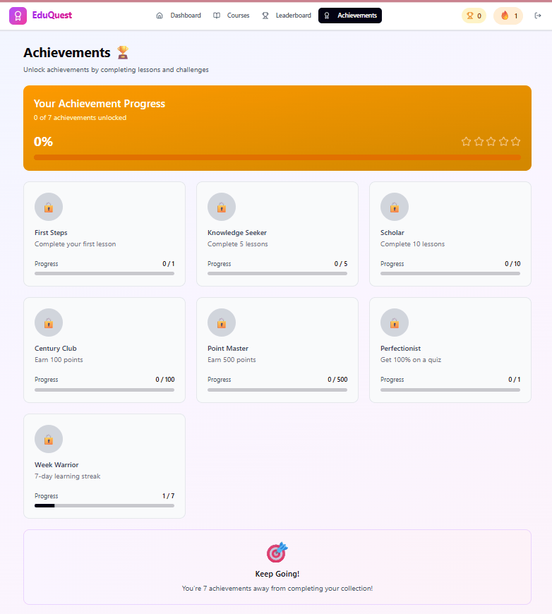

🎮 EduQuest – Gamified Learning Platform

EduQuest is a modern gamified learning platform where users can learn through quizzes, earn rewards, and track their progress in a fun and interactive way.


🚀 Features

* 🧠 Interactive quiz system
* 🏆 Leaderboard & ranking system
* 🎯 Achievement & reward system
* 📊 User progress tracking
* 🔐 Authentication using Supabase
* ⚡ Fast build with Vite


🛠 Tech Stack

* **Frontend:** React + Vite
* **Styling:** Tailwind CSS
* **Backend:** Supabase
* **Tools:** PostCSS, Node.js


📂 Project Structure


eduquest/
│
├── src/                # Main source code
├── supabase/           # Supabase config & backend setup
├── utils/              # Utility/helper functions
├── guidelines/         # Project docs or notes
│
├── index.html          # Root HTML file
├── vite.config.ts      # Vite configuration
├── postcss.config.mjs  # PostCSS config
│
├── package.json        # Project dependencies
├── package-lock.json   # Dependency lock file
│
├── README.md           # Project documentation
└── SECURITY.md         # Security policy


⚙️ Installation & Setup

```bash
git clone https://github.com/your-username/eduquest.git
cd eduquest
npm install
npm run dev
```


🔑 Environment Variables

Create a `.env` file in the root directory:

```
VITE_SUPABASE_URL=your_project_url
VITE_SUPABASE_ANON_KEY=your_anon_key
```


📸 Screenshots




🌐 Live Demo


⚠️ Notes

* Make sure Supabase credentials are correct
* Node modules should be installed before running
* Use `.env` file for sensitive data


🤝 Contributing

Contributions are welcome! Feel free to fork this repo and submit a pull request.


📜 License

This project is licensed under the MIT License.
